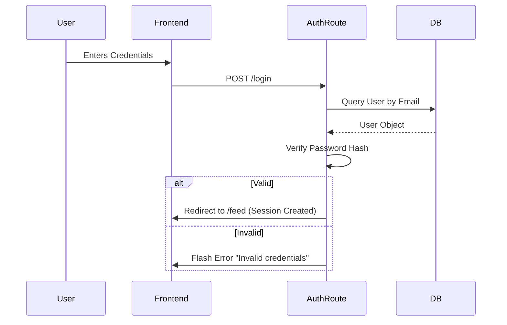

# Project Flow & Architecture Documentation

## 1. Overview
**Discussion Den** is a community-driven platform built with **Flask** (Python) for the backend and **Vanilla JavaScript** with **Bootstrap 5** for the frontend. It uses **SQLite** as the database.

The application follows a **Model-View-Controller (MVC)** pattern (adapted for Flask as MVT - Model-View-Template).

## 2. Backend Architecture (Flask)
The backend manages data, authentication, and serves HTML templates.

### Key Components
*   **`app.py`**: Application entry point. Initializes Flask, extensions (DB, LoginManager), and registers blueprints.
*   **`models.py`**: Defines Database Schema using SQLAlchemy ORM.
    *   `User`: Base account credentials.
    *   `Persona`: Alternate identities for users.
    *   `Community`: Sub-forums (e.g., r/technology).
    *   `Post`: Content created by Users or Personas.
    *   `Comment`: Hierarchical comments on posts.
    *   `Vote` / `Save`: User interactions.
*   **Routes (Blueprints)**:
    *   `auth.py`: Login, Register, Logout.
    *   `feed.py`: Main feed, infinite scroll API.
    *   `post.py`: CRUD operations for posts and comments.
    *   `community.py`: Community interactions.
    *   `persona.py`: Managing and switching personas.

### Request Lifecycle
1.  **Request**: User sends HTTP request (GET/POST).
2.  **Routing**: Flask matches URL to a view function.
3.  **Authentication**: `Check @login_required` decorator. Loads user from session via `load_user`.
4.  **Controller Logic**: View function queries DB models, processes forms.
5.  **Response**:
    *   **HTML**: Renders Jinja2 template with data.
    *   **JSON**: Returns data for AJAX requests (e.g., voting, infinite scroll).

## 3. Frontend Architecture
The frontend is a hybrid of **Server-Side Rendering (SSR)** and **Client-Side Interactivity**.

### Styling strategy
*   **Bootstrap 5**: Grid system, modals, and base components.
*   **Custom CSS (`style.css`)**:
    *   **CSS Variables**: Extensive use for theming (light/dark mode).
    *   **Glassmorphism**: Translucent UI elements (`backdrop-filter`).
    *   **Animations**: Keyframes for smooth transitions.
    *   **Gradient System**: Consistent branding colors.

### JavaScript Logic
*   **`theme.js`**: Handles Dark/Light mode toggle (persisted in `localStorage`) and scroll animations.
*   **`feed.js`**: Manages the main feed interactions.
    *   **AJAX**: Used for Voting (`/api/post/<id>/vote`) and Saving (`/api/post/<id>/save`).
*   **`post.js`**: Handles interactions on the Post Detail page.
    *   **Comment Rendering**: Fetches comments via API and renders them recursively in the browser.
*   **`persona.js`**: AJAX request to switch active identity in the session without full re-login.

## 4. Key Feature Flows

### 4.1 Authentication Flow

### 4.2 Persona Switching Logic
Allows users to post under different aliases.
1.  **User** selects a Persona from the dropdown.
2.  **`persona.js`** sends `POST /api/persona/switch` with `persona_id`.
3.  **Backend** updates `session['active_persona_id']`.
4.  **Frontend** reloads the page to reflect the new identity in templates (e.g., changes Avatar, "Posting as..." label).

### 4.3 Commenting System (Recursive)
Comments support infinite nesting.
*   **Database**: Adjacency List model (`parent_comment_id`).
*   **Backend API**: Returns flat list of comments.
*   **Frontend (JS)**:
    1.  Converts flat list to Tree structure.
    2.  Recursively renders HTML nodes (`renderNode`).
    3.  Handles "Reply" button clicks to show inline forms.

## 5. Security Measures
*   **CSRF Protection**: All forms and AJAX requests require a `X-CSRFToken` header (managed by `Flask-WTF`).
*   **Password Hashing**: Uses `Werkzeug` security helpers.
*   **Input Sanitization**: `Vue` or `Jinja2` auto-escaping prevents XSS. `bleach` is used if raw HTML is ever allowed (currently plain text).
